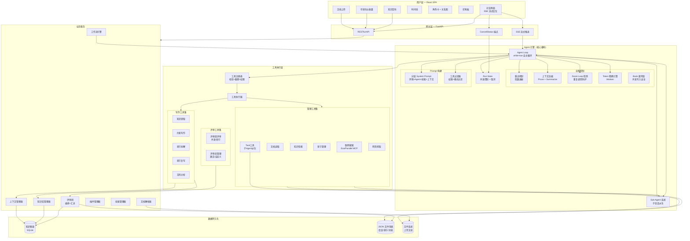

# 系统架构设计 — AI 小说写作辅助 Agent v3.0

## 核心设计理念

**知识库是唯一事实源。** 所有 LLM 生成必须严格基于知识库中的结构化内容。

**人类掌控创作主权。** AI 不替代作者的创意决策。

**自主循环交互模型。** Agent 采用真正的 while-loop 自主循环，LLM 自行决定何时停止。完备的重试、压缩、并发控制、子 Agent 派生。

---

## 架构总览



---

## 分层说明

### Agent 引擎（核心）

| 模块 | 文件 | 职责 |
|------|------|------|
| Agent Loop | `agent_loop.py` | while-true 自主循环。LLM 决定停止（无 tool_calls 即终止）。拆分为阶段处理器：prepare → compact → sitrep → pulse → call_llm → terminal/toolcall → bookkeep |
| Loop State | `loop_state.py` | 循环状态对象（计数器/标志）+ 漂移检测 + KB 守卫 + 幻觉统计 + LoopMetrics 可观测性。纯逻辑可单测 |
| Run State | `run_state.py` | Session 级并发控制。同一 session 只允许一个 run，支持 cancel 中断 |
| Sub-Agent | `sub_agent.py` | 子 Agent 派生。通过 task 工具创建子会话，独立上下文，支持 general/extract/plan/write 类型 |
| Retry | `retry.py` | 指数退避重试。识别 5xx/rate-limit/overloaded，backoff 2s→4s→8s...→30s 上限 |
| Compaction | `compaction.py` | 两阶段压缩：Phase 1 prune 旧 tool output（保护最近 40k tokens）→ Phase 2 summarize 压缩 |
| Doom Loop | `tools.py` | 同一工具+参数连续调用 3 次 → 检测死循环，注入错误提示让 LLM 换策略 |
| Token Counter | `token_counter.py` | 基于 tiktoken 的精确 token 计算，不再用 chars//2 估算 |
| System Prompt | `system_prompt.py` | 分层动态组装：基础 Agent Prompt + 环境信息 + 书籍上下文 + 技能 + 插件 hook |
| Tool Resolver | `system_prompt.py` | 根据 Agent 类型和模式过滤工具列表（plan 模式不暴露写入工具） |

### 工具执行层

| 模块 | 文件 | 职责 |
|------|------|------|
| Tool Registry | `tools.py` | 工具注册表。输入 Schema 校验、输出截断（50k 字符/12k tokens 上限）、权限标记、**行为元数据**（streaming/mutates_kb/touches_chapter/context_aware 单一事实源） |
| Executor | `executor.py` | 工具分发执行。统一分发表 `_DISPATCH` 覆盖 97 个直接分派工具 + 17 个复合/延迟导入工具的 fallback 路由。流式工具通过 `_STREAMING_DISPATCH` 分派（15 个） |

### 关键设计决策

| 决策 | 选择 | 理由 |
|------|------|------|
| Agent 循环 | while-true + LLM 自决停止 | LLM 完全自主决定工具调用链 |
| 循环状态 | `LoopState` dataclass 收编 10 个计数器 | 拆分 God Function，状态转移可单测，告别散落局部变量 |
| 工具元数据 | `TOOL_META` 单一事实源 + `Tool.doc` + `build_tool_docs()` | 替代散落 4 处的工具名硬编码集合，新增工具只改一处。工具文档可内嵌到 `Tool.doc` 字段，通过 `build_tool_docs()` 动态生成 system prompt 文档节 |
| 幻觉脉冲 | 事件驱动（检测后才注入一次）| 取代每 3 轮周期注入，避免长会话噪声与 token 浪费 |
| 漂移检测 | 完成声明 / 验证循环 信号分离 | 各自计数与阈值，纠正话术更精准 |
| 漂移纠正 | 允许一次只读收尾工具 | 不再一刀切强制停止，避免误杀合法收尾 |
| 状态刷新 | `asyncio.to_thread` 异步化 | 原同步 SQLite+文件 IO 阻塞事件循环 |
| Prompt 注入 | 统一 `role:user` + `[系统提示]` | 部分 Provider 忽略非首条 system 消息 |
| 取消粒度 | 流式 chunk 间 + 工具执行中检查 | 长生成可中断 |
| 并发控制 | Session 级锁 + Cancel | 防止竞态，支持用户随时中断 |
| 重试策略 | 指数退避 + Retry-After 尊重 | 稳健的 API 调用，不因临时限流而崩溃 |
| 上下文压缩 | Prune → Summarize 两阶段 | 先裁剪长 tool output，不够再用 LLM 摘要，效率最高 |
| Token 计算 | tiktoken 精确计算 | 不再用字符估算，避免误判溢出 |
| 子 Agent | 子会话独立上下文 | 复杂任务拆分，不污染主会话 |
| 工具过滤 | LLM 调用前过滤 | 被禁止的工具不出现在 tool list 中，LLM 不会反复尝试 |
| 输出截断 | 12k tokens 上限 | 防止单次工具输出撑爆 context |

---

## 数据主流向

```
用户消息 → SSE → RunState.ensureRunning → Agent Loop
  → 检查是否需要 compaction → 是 → prune + summarize
  → 构建 system prompt（环境+Agent+书籍上下文+技能）
  → 过滤工具列表（按模式+权限）
  → 调用 LLM（with retry）
  → 无 tool_calls? → 输出最终文本 → 释放 RunState → 结束
  → 有 tool_calls? → doom loop 检测 → 输入校验 → 权限检查
    → 执行工具 → 输出截断 → 追加 messages → 继续循环
    
Cancel 请求 → RunState.cancel → 设置 cancelled flag → 循环内 check → 抛出 CancelledError
```

---

## 变更记录

### v2.6 - 2026-07-16: AI味扫描引擎 + 批量导入优化

- 变更类型: 新增 + 修复 + 优化
- 涉及模块: ai_flavor_scanner(新), quality_gate, continuation_pipeline, context_manager, knowledge_scope, headless_loop, chapter_store, imports, knowledge, search, graph_store, reviewers, start.bat, start.ps1, ReviewPanel.tsx
- 描述: 新增AI味扫描引擎——7项纯规则检测（过渡词/模板句式/模糊词/面部微表情/段落同构/句长均匀度/对话标签），零token消耗，集成到finalize_chapter和quality_gate。新增AI味嗅觉审查员（评审团第14位）。AI味反馈闭环：上一章问题自动注入后续写作约束。修复知识检索零匹配（子串匹配fallback）、Neo4j宕机崩溃（3个batch_add方法空驱动检查）、启动脚本Neo4j容器缺失（自动创建）、评审团前端分类缺失（新增续写专项区）。优化章节拆分正则（2→10种格式）、LLM fallback三段采样、批量导入O(n²)→O(n)。

**新增模块:**
- `core/ai_flavor_scanner.py` — 7项纯规则检测引擎
- `reviewers/ai_flavor_sniffer.yaml` — AI味嗅觉审查员人设
- `tests/test_ai_flavor_scanner.py` — 21个测试用例

**集成修改:**
- `continuation_pipeline.py` — ChapterValidationResult新增ai_flavor_score/ai_flavor_issues
- `quality_gate.py` — QualityResult新增AI味字段，评审前扫描
- `knowledge_scope.py` — WritingKnowledgeScope新增prev_chapter_issues
- `context_manager.py` — 注入上一章发现的问题
- `headless_loop.py` — step_result持久化AI味评分
- `chapter_store.py` — 新增batch_add_chapters批量导入
- `imports.py` — 章节拆分正则10种格式 + LLM三段采样
- `knowledge.py` — _prepare_writing子串匹配fallback
- `graph_store.py` — 3个batch_add方法空驱动防御
- `reviewers/ai_flavor_sniffer.yaml` — 新增评审员

---

### v2.3 - 2026-07-03: 参考书分析引擎 + 上下文效率大修

- 变更类型: 新增 + 优化 + 修复
- 涉及模块: reference_analyzer(新), analysis_routes(新), reference_analysis(新), compaction, agent_loop, loop_state, llm_client, retry, config, graph_store, knowledge, writer, context_manager, knowledge_scope, system_prompt, autopilot/planner, tools, tool_meta, executor, sessions, settings, 前端 ReferenceBooksPanel, SettingsModal, api
- 描述: 新增纯 Python 参考书分析引擎，实现结构分析和文风量化两条全链路（分析→缓存→Prompt 注入→前端展示）。上下文效率大幅提升——主动式陈旧工具结果裁剪（每轮执行）、Compaction 激进调优、LLM 客户端连接可靠性重构、系统 Prompt prefix caching 优化。动态图谱 schema 支持自定义关系类型。

**新增模块:**
- `core/reference_analyzer.py` — 纯 Python 确定性分析引擎（无 LLM 调用）：结构分析（字数/对话比/段落/句子/节奏曲线）和文风量化（句长分布/TTR/标点模式/成语密度/段落统计）
- `routes/analysis_routes.py` — 5 个分析 API 端点
- `tools/impl/reference_analysis.py` — `analyze_structure` / `quantify_style` 工具实现
- `data/analyses/` — 分析结果 JSON 缓存目录

**核心优化:**
- `compaction.py` — 新增 `prune_stale_tool_results()` 主动裁剪（每轮执行，保护尾 60K tokens，陈旧消息截断至 800 tokens）
- `config.py` — Compaction 调优：threshold 0.70, protected_tail 60K, tail_turns 4, max_tool_output 30K；token_budget_ratio 0.0
- `llm_client.py` — 自定义 httpx 客户端绕过系统代理；同步 chat 新增重试（5 次指数退避）
- `graph_store.py` — 动态关系类型支持，硬编码排除列表替换为动态 schema 查询
- `writer.py` — 自动注入参考文风分析数据；稳定 system prompt 缓存（prefix caching）
- `system_prompt.py` — 仅显示最近 5 章详情，早期章节以计数摘要替代
- `autopilot/planner.py` — 优化指令，避免读取前文全文

**修复:**
- `sessions.py` — Context Usage API 改用 `turns_from_history` + `count_message_tokens` 精确计算
- `settings.py` — Provider API Key 编辑时空字符串不再覆盖已存储 key
- `graph_store.py` — 自定义关系类型加载不再崩溃

**前端变更:**
- ReferenceBooksPanel — 重构为 TypeScript，新增分析区（结构分析/文风量化按钮）、报告视图（指标+图表+节奏曲线）、缓存徽章
- SettingsModal — 编辑 provider 时 api_key 默认空字符串，提示"留空保持不变"

**新增测试:** 2 文件 417 行覆盖分析引擎、compaction 裁剪、planner 指令

---

### v2.1 - 2026-07-03: 推演系统3.0 (Dual-Agent Simulation Engine)

- 变更类型: 新增 + 重构
- 涉及模块: simulation/(新), character_agent(新), narrator_agent(新), simulation_store(新), state_agent(新), hot_choices_agent(新), simulation_routes(新), agent_loop, llm_client, tools, server, 前端 simulation/ 全套
- 描述: 推演系统3.0——全新的双 Agent 交互式叙事推演引擎，替代已废弃的 InteractiveAgent。CharacterAgent 角色扮演 + NarratorAgent 旁白编排，支持角色 POV/旁白 POV 双模式。JSONL 追加式事件存储替代 Neo4j 分支存储。新增结构化状态追踪、快捷动作建议、分支/主线推广机制。

**新增模块:**
- `core/simulation/character_agent.py` — 角色 Agent：从知识图谱构建角色档案，生成结构化角色响应
- `core/simulation/narrator_agent.py` — 旁白 Agent：双模式推演编排（角色 POV + 旁白 POV），并行角色唤醒，隐式 7 步判定循环
- `core/simulation/simulation_store.py` — JSONL 事件存储：会话/回合/分支/选择/状态增量持久化，支持记忆压缩
- `core/simulation/state_agent.py` — 结构化状态追踪：每次回合异步生成状态增量操作
- `core/simulation/hot_choices_agent.py` — 快捷动作建议：独立 LLM 调用生成 2-5 个用户动作建议
- `routes/simulation_routes.py` — 14 个推演 API 端点（SSE 流式 + RESTful）

**前端新模块 (7 个组件):**
- `frontend/src/features/simulation/` — 完整推演前端子包
- SimulationLayout / SimulationSetup / StoryStage / SnapshotPanel / BranchTimeline
- API 层 / Store / 类型定义 / SSE 流解析器

**核心改进:**
- `agent_loop.py` — 新增计划检测（空计划推送机制）、琐碎完成检测（合成有意义摘要）、安全网（异常终态兜底）
- `llm_client.py` — 多 Provider 支持（Provider 级客户端缓存、设置驱动的模式路由），DeepSeek Reasoner 支持
- `tools.py` — DoomLoopDetector、模糊工具匹配、新增 20+ 工具注册
- `server.py` — 集中日志轮转、Supervisor 活动追踪、后台会话清理、DELETE 确认中间件、工作流步骤扩展

**废弃:**
- `core/interactive_agent.py` — 标记为 DEPRECATED，由 NarratorAgent + CharacterAgent 替代
- `core/interactive_store.py` — 标记为 DEPRECATED，由 SimulationStore 替代

**新增测试:** 3 个文件 28 用例覆盖 CharacterAgent / NarratorAgent / SimulationStore

---

### v2.0.0 - 2026-07-02: 叙事逻辑引擎 + 交互故事 + 全栈成熟化

- 变更类型: 新增 + 重构 + 质量
- 涉及模块: 全栈
- 描述: 项目从 v1.x 系列跨越至 v2.0.0，标志着从"功能验证"到"生产级成熟"的转变。核心新增叙事逻辑引擎（`narrative_logic/` 子包）、交互式故事系统、本体生成器、图搜索增强。前端组件从 40+ 增至 68 个，测试从 20+ 文件增至 34 文件 451 用例。完善 CI/CD 基础设施（ruff + mypy + pytest + tsc + eslint + build 全链路）。

**新增模块:**
- `core/narrative_logic/` — 约束检查器/置信度评分器/约束持久化/影响传播器
- `core/interactive_agent.py` + `core/interactive_store.py` — 图谱驱动分支叙事引擎
- `core/narrative_events.py` — 叙事事件结构化追踪
- `core/ontology_generator.py` — 世界观本体自动生成
- `core/graph_search.py` — 高级图搜索与路径分析
- `core/update_checker.py` — GitHub Releases 版本检测
- `core/event_store.py` — 事件持久化
- `core/session_state.py` / `core/settings.py` — 会话与设置管理
- `core/thread_pools.py` — 统一线程池
- `core/workflow_agent.py` — 工作流驱动 Agent
- `core/writer.py` — 写作引擎核心
- `core/agent_config.py` / `core/agent_context.py` / `core/app_context.py` — Agent 配置与上下文
- `data/stores/` — 模块化存储层 (BookStore/ChapterStore/MetaStore/SessionStore/WorldbuildingStore)

**前端新组件 (28 个):**
- CharacterArcTimeline / ForeshadowBoard / FullGraphView / GraphInsights
- InteractivePanel / MaterialsPanel / ReferenceBooksPanel / WorldbuildingMetrics
- CommandPalette / ShortcutsModal / ExportMenu / ImportDialog / StylesPanel
- WorkflowPoolPanel / AutopilotModal / TaskProgressPanel / SupervisorBadge / BookTransformPanel
- chat/ 子组件: AutopilotConsole / ContextBar / PatchNotification / PlotCardSelector / ProgressIndicator / QuestionCard / RunLedger / SlashMenu / TaskListPanel / WorkflowProgress / WritingPreview

**CI/CD:**
- `.github/workflows/ci.yml` — ruff + mypy + pytest + tsc + eslint + build
- `.github/workflows/ci.yml` — CI 检查
- `.pre-commit-config.yaml` — 预提交钩子

---

### v2.9 - 2026-06-20: 结构化 Part 系统 + 完整历史持久化

- 变更类型: 新增 + 重构
- 涉及模块: parts(新增), llm_client, agent_loop, loop_state, token_counter, routes/chat, frontend/MessageList, tests/test_parts(新增)
- 描述: 引入结构化 Part 类型系统,补齐三块真实缺口——reasoning 捕获、完整历史持久化、章节变更结构化浮现。**reasoning 捕获但不注入回 LLM 上下文**(文学创作显式输出 > 隐式思考)。
- 新增 `core/parts.py`:`TextPart`/`ToolCallPart`/`ToolResultPart`/`ChapterDiffPart`/`ReasoningPart` + `Turn` 聚合 + 序列化/重建
- reasoning 捕获:`llm_client` 流式捕获 `delta.reasoning_content`,`Turn.to_llm_messages` 明确排除 reasoning 不注入回 LLM(省 token),但持久化供前端折叠查看
- 完整历史持久化:`_persist_turn` 存完整 Turn(parts),`_load_history` 从 parts 重建扁平消息(向后兼容旧格式)
- 章节变更浮现:写作/编辑工具执行后生成 `ChapterDiffPart`,前端渲染变更卡片
- 新增 13 用例覆盖序列化/重建/旧数据兼容/reasoning 不注入保证

### v2.7 - 2026-06-20: Agent Loop 结构化重构

- 变更类型: 重构
- 涉及模块: loop_state(新增), agent_loop, tools, agent, config, tests/test_agent_loop(新增)
- 描述: 将 640 行的 `_loop_inner` God Function 拆分为阶段处理器，围绕新增的 `LoopState`/`LoopMetrics` 重组 10 个散落循环状态变量与漂移/幻觉/KB 守卫逻辑。工具行为元数据收敛为单一事实源 `TOOL_META`，消除 agent_loop 中 4 处硬编码工具名集合。

**新增模块:** `core/loop_state.py` — `LoopState` dataclass + `LoopMetrics` + 漂移/KB/幻觉阈值常量 + `TAILSAFE_TOOLS`
**核心改动:**
- 抽 `LoopState` 收编 round/hallucination_streak/completion_claims/verify_loops/kb_mutation_streak/drift_corrected 等 10 个状态
- `_loop_inner` 拆为 `_prepare_initial_messages` / `_maybe_compact` / `_inject_sitrep` / `_stream_llm_with_retry` / `_handle_terminal_response` / `_handle_tool_calls` / `_prepare_tool_calls` / `_process_tool_result` / `_handle_max_rounds`
- `_process_tool_result` 统一处理流式/并行两条分支的 plot_cards/writing_result/task_list/patch_result/review_result，消除 ~120 行重复
- 工具元数据: `Tool` 增加 `streaming/mutates_kb/touches_chapter/context_aware` 字段 + `TOOL_META` 表，agent_loop 改读属性
- 幻觉脉冲改事件驱动：仅检测到幻觉后注入一次（`should_inject_pulse`），删除每 3 轮周期注入
- `round_num -= 1` 黑魔法移除：改用 `hallucination_retries` 独立计数，周期注入不再错位
- 漂移检测信号分离：`completion_claims` 与 `verify_loops` 各自计数与阈值
- 漂移纠正后允许一次只读收尾工具（`TAILSAFE_TOOLS`），不再一刀切强制停止
- `_build_sitrep` 异步化（`asyncio.to_thread`），修阻塞事件循环
- 中途注入 prompt 统一 `role:user` + `[系统提示]` 前缀
- 取消粒度细化：流式 chunk 间检查 `handle.cancelled`
- `max_rounds` 触顶时让 LLM 做一次简短汇报而非裸停止
- `LoopMetrics` 收集轮次/幻觉命中/工具/token/压缩等，循环结束日志输出
- `config.agent.adaptive_temperature` 开关，温度启发式可 A/B
- 删除 `agent.py` 中无引用的 `plan_actions`/`suggest_skill`（保留 `classify_content`）
- 新增 `tests/test_agent_loop.py`（29 用例覆盖 LoopState/漂移/幻觉/KB/元数据/terminal handler）

---

### v2.6 - 2026-06-17: 文风/技能系统双源分离

- 变更类型: 重构
- 涉及模块: styles.py, skills.py, executor.py, tools.py, system_prompt.py, agent_loop.py, styles_route.py(新), routes/__init__.py
- 描述: 文风和技能（工作流）实现系统默认/用户自定义双源分离，支持开源时只共享默认内容。新增文风 CRUD REST API、manage_styles 工具、用户风格持久化（JSON文件）。修复 agent_loop 中活跃风格不自动注入系统提示的遗留 bug。

**双源结构:**
- 系统默认: `styles/` + `skills/` → 提交到 git（开源共享）
- 用户自定义: `data/styles/` + `data/skills/` → gitignored（私有）
- 持久化: `data/active_styles.json` → 每本书的活跃风格

**新增工具:** manage_styles（CRUD 用户风格）
**新增 API:** GET/PUT /api/styles, POST/PUT/DELETE /api/styles/custom/{name}, GET/PUT /api/skills/custom{name}, GET/PUT /api/books/{book_id}/style
**修复:** agent_loop.py 第97行原本不传 style_name，现在从持久化读取活跃风格

---

### v2.5 - 2026-06-16: 并行写入安全

- 变更类型: 重构
- 涉及模块: book_locks(新增), json_store
- 描述: 新增 book 级可重入写锁（threading.RLock），保护 json_store 中所有复合读-改-写操作的原子性。同一 book 的并行会话写入现在串行化，不同 book 的写入仍可并发。解决多会话并行时 JSON 文件存储的丢失写入（lost update）问题。

**新增模块:** `core/book_locks.py` — 全局 per-book RLock 管理器
**保护范围:** json_store 中 25 个复合写方法（add_chapter/edit_chapter/delete_chapter/add_worldbuilding_entry/add_timeline_event/update_outline_chapter 等）
**实测验证:** 无锁时 20 并发写入丢失 12/20 章节（60% 数据丢失），加锁后零丢失

---

### v2.4 - 2026-06-16: 联网搜索 Agent

- 变更类型: 新增
- 涉及模块: web_search(新增), tools, executor, sub_agent, system_prompt, config
- 描述: 实现联网搜索架构——通过 MCP JSON-RPC 2.0 协议调用 Exa/Parallel 双搜索后端，支持 session 级 A/B 分流、SSE 响应解析、URL 内容抓取。新增 research 子 Agent 类型用于多轮深度调研。

**新增工具:** web_search, web_fetch
**新增子 Agent:** research（联网调研助手）
**新增配置:** WebSearchConfig（provider/api_key/enabled/timeout）
**搜索后端:** Exa (`mcp.exa.ai/mcp`) + Parallel (`search.parallel.ai/mcp`)
**触发条件:** WEBSEARCH_ENABLED=true（默认开启），LLM 根据工具描述自主判断是否需要联网
**环境变量:** WEBSEARCH_PROVIDER, EXA_API_KEY, PARALLEL_API_KEY, WEBSEARCH_ENABLED

---

### v2.3 - 2026-06-16: 剧情卡片交互

- 变更类型: 新增
- 涉及模块: tools, executor, agent_loop, chat(SSE), ChatPanel.jsx
- 描述: 新增剧情卡片工具(suggest_plot_directions)——Agent规划剧情时生成多个走向选项，以可视化卡片呈现给用户。支持选择卡片、自定义方向或拒绝全部重新引导。使用question_manager阻塞机制等待用户选择。

**新增工具:** suggest_plot_directions
**交互流程:** Agent调用工具 → LLM生成3-5个剧情方向 → 前端渲染卡片 → 用户选择/自定义/拒绝 → Agent继续

---

### v2.2 - 2026-06-15: 评审团系统

- 变更类型: 新增
- 涉及模块: review_panel, sub_agent, system_prompt, tools, executor, json_store, routes/reviews, ReviewPanel.jsx
- 描述: 新增评审团系统——8位预设评审员（编剧/文学编辑/逻辑审校/爽文读者/情感型读者/硬核党/挑刺王/休闲读者），支持自定义评审员、并发/串行评审模式、汇总报告+个人详细反馈

**新增工具:** run_review, manage_reviewers
**新增API:** GET/PATCH /reviewers, POST /reviewers/custom, GET/DELETE /reviews
**新增前端:** 评审团面板（卡片墙+激活管理+评审历史+报告展示）
**新增配置:** reviewers/default.yaml（评审员人设定义）

---

### v2.1 - 2026-06-12: 章节版本控制

- 变更类型: 新增
- 涉及模块: json_store, tools, executor, routes/chapters
- 描述: Git 风格章节版本控制——每次编辑创建新版本，支持 history/revert/diff，旧数据自动迁移

**数据模型变化:**
```
章节 {
  id, title, current_version,
  versions: [{ id, content, title, message, timestamp, parent, word_count }]
}
```

**新增工具:** edit_chapter, chapter_history, revert_chapter, diff_chapters
**新增API:** GET /chapters/{id}/history, GET /chapters/{id}/versions/{vid}, POST /chapters/{id}/revert

---

### v2.0 - 2025-06-12: 自主循环架构

- 变更类型: 重构
- 涉及模块: agent_loop, llm_client, compaction, tools, system_prompt, run_state, retry, sub_agent, token_counter, chat.py, executor.py, config.py, main.py
- 描述: 实现 while-true 自主循环、指数退避重试、两阶段上下文压缩、Session 并发控制+取消、doom loop 检测、工具输入校验+输出截断、子 Agent 派生、分层动态 system prompt、精确 token 计算

---

### v3.0 - 2026-06-22: 持久任务引擎 + 自驱写作 + 全书变换工具

- 变更类型: 新增 + 集成修复
- 涉及模块: task_queue(新增), headless_loop(新增), supervisor(新增), autopilot(新增), quality_gate(新增), scheduler(修复), event_bus, run_state, server, system_prompt, tools, executor, chapter_tools, json_store, 前端(TaskProgressPanel/AutopilotModal/SupervisorBadge/BookTransformPanel)
- 描述: 三层架构升级——持久任务引擎（TaskQueue + TaskRunner + Supervisor）让 Agent 具备持久运行能力；Autopilot 自主写作引擎实现目标驱动自驱；全书变换工具集（5个工具）实现"一句话修改整部书"。修复了 scheduler→runner 断链、quality_gate 孤立、token 预算追踪死代码、supervisor.record_activity 未接线等 4 处集成断点。

**新增模块:**
- `core/task_queue.py` — PersistentTask/TaskStep 持久化任务队列，Task 级 audit_mode（hard/soft/autonomous）
- `core/headless_loop.py` — 无 HTTP 连接的 agent_loop 执行器 + TaskRunner 类（后台驱动 task step）
- `core/supervisor.py` — 监督进程：stale/failed/retry/scheduled 任务检查
- `core/autopilot.py` — Autopilot 规划器+执行器：高层指令 → TaskStep 序列
- `core/quality_gate.py` — 质量门控：复用 review_panel 轻量评审，评分低于阈值暂停
- `routes/tasks.py` — Task CRUD + SSE stream + autopilot 端点
- `frontend/components/BookTransformPanel.jsx` — 全书变换 UI 面板
- `frontend/components/TaskProgressPanel.jsx` — 任务进度面板
- `frontend/components/AutopilotModal.jsx` — Autopilot 配置弹窗
- `frontend/components/SupervisorBadge.jsx` — 后台任务指示器

**新增工具（工作包 D — 全书变换）:**
- `apply_directive_globally` — 自然语言指令全书变换（自动判断串行/并行）
- `find_replace_book` — 全书字面/正则查找替换
- `transform_chapters_batch` — 批量变换指定章节（patch/rewrite 模式）
- `restyle_book` — 全书文风套用
- `summarize_book` — 全书摘要生成（长程 context 注入）

**集成修复（4 处断线）:**
1. scheduler `_execute_task` 改 async + 创建 PersistentTask 后调用 `runner.start_task()`
2. quality_gate 接入 TaskRunner `_execute_step`：step config 标记 `quality_gate` 时触发评审
3. token 预算追踪：TaskRunner 每步完成后调 `autopilot.update_tokens`，超限 pause
4. supervisor.record_activity：server.py lifespan 订阅 TASK_STEP_COMPLETED 事件

**system_prompt 增强:** sitrep 注入全书摘要（book_summary）+ 活跃 Task 概要 + audit_mode
