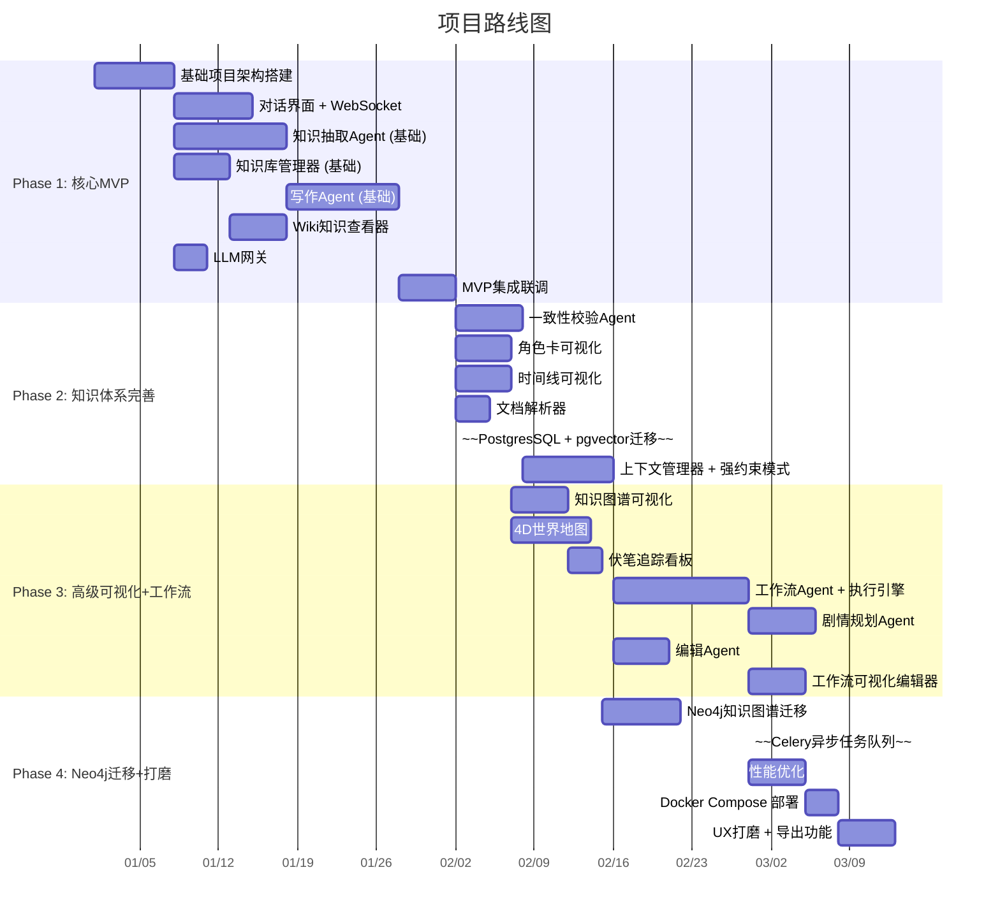

# 实施路线图

---

## 阶段概览

---

## Phase 1: 核心 MVP（预估 6-8 周）

**目标：** 跑通"对话 → 知识抽取 → 知识约束写作"核心链路

| 模块 | 交付物 | 优先级 | 依赖 |
|------|--------|--------|------|
| 项目架构 | FastAPI + React + SQLite 脚手架 | P0 | — |
| 对话界面 | 基础聊天UI + SSE | P0 | 脚手架 |
| LLM网关 | DeepSeek API 接入 + prompt模板 | P0 | — |
| 知识抽取Agent | 基础实体识别（人物/地点） | P0 | LLM网关 |
| 知识库管理器 | 基础CRUD + SQLite存储 | P0 | — |
| 写作Agent | 基础知识约束写作（弱约束模式） | P0 | 知识库 + LLM网关 |
| Wiki查看器 | 实体列表 + 详情页 | P1 | 知识库管理器 |

**MVP 知识约束策略：**
- 数据存储用 SQLite + JSON 字段模拟图谱
- 上下文构建只依赖 LLM 上下文窗口（跳过向量库）
- 写作 Agent 使用"弱约束"模式（可补充但标记）
- **目标：** 让用户能感受"写了设定 → AI 记住 → 写作时遵守"的闭环

**验证标准：**
1. 用户通过聊天添加 3 个角色设定
2. AI 根据设定写出 500 字正文
3. 正文内容和设定一致（无冲突事实）
4. 用户可以在 Wiki 页面查看所有设定

---

## Phase 2: 知识体系完善（预估 4-5 周）

| 模块 | 交付物 | 优先级 | 说明 |
|------|--------|--------|------|
| 一致性校验Agent | 知识冲突检测 | P0 | 防止知识库矛盾 |
| 角色卡可视化 | 角色详情、关系、轨迹 | P0 | 核心可视化需求 |
| 时间线可视化 | 事件/章节在时间轴上分布 | P0 | 清晰展现创作脉络 |
| 文档解析器 | txt/docx/md 上传解析 | P1 | 方便导入已有草稿 |
| ~~pgvector 迁移~~ | 从纯 LLM 上下文升级到向量检索 | P1 | ❌ 取消（未实施） |
| 上下文管理器 | 强约束模式正式上线 | P0 | 严格知识约束写作 |

---

## Phase 3: 高级可视化 + 工作流（预估 5-6 周）

| 模块 | 交付物 | 优先级 | 说明 |
|------|--------|--------|------|
| 知识图谱 | 实体关系力导向图 | P0 | 最直观的全局视图 |
| 4D世界地图 | 地理+时间维度地图 | P1 | 高阶功能 |
| 伏笔看板 | 伏笔→回收追踪 | P1 | 悬疑类网文刚需 |
| 工作流Agent | 对话式工作流生成 | P0 | 核心差异化功能 |
| 工作流执行引擎 | 编排Agent流水线 | P0 | 同↑ |
| 剧情规划Agent | 根据知识库给选项 | P1 | 辅助创作 |
| 编辑Agent | 润色/扩写/缩写 | P1 | 贴身编辑 |

---

## Phase 4: Neo4j + 生产化（预估 3-4 周）

| 模块 | 交付物 | 优先级 | 说明 |
|------|--------|--------|------|
| Neo4j 迁移 | SQLite → Neo4j | P0 | ✅ 已完成 |
| ~~Celery 任务队列~~ | ~~异步LLM任务~~ | P1 | ❌ 取消（改用 asyncio + TaskQueue） |
| Docker Compose | 一键部署 | P1 | ✅ 已完成 |
| 性能优化 | 大知识库下响应速度 | P1 | 🔄 持续 |
| 导出功能 | 小说全文导出 txt/docx | P1 | ✅ 已完成 |

---

## 分阶段决策矩阵

| 决策点 | Phase 1 | Phase 2 | Phase 3 | Phase 4 |
|--------|---------|---------|---------|---------|
| 数据库 | SQLite | — | — | →JSON文件 + SQLite FTS5 |
| 图谱 | JSON模拟 | — | — | →Neo4j |
| 任务队列 | asyncio | — | — | →asyncio + TaskQueue |
| LLM | DeepSeek | — | DeepSeek（多Provider） | ✅ 多Provider |
| 容器化 | 无 | — | — | ✅ Docker Compose |

每个阶段结束后，应进行一次**可运行演示**，确保价值尽早交付。

---

## 追加记录

### v11 — 2026-06-20: 结构化 Part 系统 + 完整历史持久化
- 变更类型: 新增 + 重构
- 涉及模块: parts(新增), llm_client, agent_loop, loop_state, token_counter, routes/chat, frontend/MessageList, tests/test_parts(新增)
- 描述: 引入 Part 类型系统,补齐 reasoning 捕获(静默丢弃修复)、完整历史持久化(刷新可回放执行过程)、章节变更结构化浮现(变更卡片)。reasoning 捕获但不注入回 LLM(文学创作显式输出优先)。新增 13 用例,全部 303 测试通过。

### v9 — 2026-06-20: Agent Loop 结构化重构
- 变更类型: 重构
- 涉及模块: loop_state(新增), agent_loop, tools, agent, config, tests/test_agent_loop(新增)
- 描述: 将 640 行 `_loop_inner` God Function 拆分为阶段处理器，状态收编进 `LoopState`/`LoopMetrics`。工具行为元数据收敛为 `TOOL_META` 单一事实源，消除 4 处硬编码工具名集合。幻觉脉冲改事件驱动，漂移信号分离，sitrep 异步化，prompt 注入统一 role:user。新增 29 用例测试覆盖。
- 影响: 对外 API（`run_agent_loop`/`AgentConfig`/`LoopEvent`）不变；`sub_agent.py`/`chat.py` 无需改动；所有 277 测试通过。

### v8 — 2026-06-16: 剧情卡片交互
- 变更类型: 新增
- 涉及模块: tools, executor, agent_loop, chat.py, ChatPanel.jsx, system_prompt
- 描述: 新增剧情卡片工具——Agent规划剧情时生成多个走向选项以可视化卡片呈现，用户可选择/自定义/拒绝，使用question_manager阻塞等待。前端PlotCardSelector组件渲染富卡片。

### v7 — 2026-06-15: 评审团系统
- 变更类型: 新增
- 涉及模块: review_panel, sub_agent, system_prompt, tools, executor, json_store, routes/reviews, ReviewPanel.jsx, reviewers/default.yaml
- 描述: 新增评审团系统——8位预设评审员（编剧/文学编辑/逻辑审校/爽文读者/情感型读者/硬核党/挑刺王/休闲读者），支持自定义评审员、并发/串行评审模式、汇总报告+个人详细反馈。前端卡片墙管理+评审历史。

### v5 — 2026-06-11: Run Loop + 拆书复写工具集
- 变更类型: 新增
- 涉及模块: Agent 决策引擎、工具注册表、拆书复写工具集
- 描述: Agent 架构从单向流水线升级为 Run Loop（LLM ↔ tool result 循环）。新增 5 个拆书复写工具（decompose_chapter/extract_style/reconstruct_chapter/compare_plot/count_words）。新增 full_novel_reconstruct 和 chapter_rewrite 两个 Skill。

### v13 — 2026-07-02: v2.0.0 全栈成熟化
- 变更类型: 里程碑发布
- 涉及模块: 全栈
- 描述: 项目从 v1.x 系列跨越至 v2.0.0。核心新增叙事逻辑引擎（`narrative_logic/` 子包）、交互式故事系统、本体生成器、图搜索增强。前端 68 组件，34 测试文件 451 用例。CI/CD 全链路（ruff + mypy + pytest + tsc + eslint + build）。数据层模块化重构（stores/ 子包）。详见 CHANGELOG.md 和 ARCHITECTURE.md。

### v12 — 2026-06-24: 草稿/定稿双轨 + 叙事导演 + RunLedger增强
- 变更类型: 新增
- 涉及模块: chapters.py, json_store.py, git_store.py, styles_route.py, loop_state.py, agent_loop.py, ChaptersPanel.tsx, MarkdownEditor.jsx, RunLedger.jsx, types/index.ts
- 描述: 新增草稿/定稿双轨流程（章节status字段，promote/demote API，前后端完整UI）；叙事导演系统API（NarrativeStrategy六维度：pov/pacing/reveal_density/foreshadow_budget/chapter_arc/tone_guidance）；RunLedger增强为展示工具调用分布。同步修正TECH_STACK.md为实际技术栈。

### v4 — 2026-06-11: Agent 架构重构
- 变更类型: 新增
- 涉及模块: Agent 决策引擎、工具注册表、技能系统
- 描述: chat 端点从固定 `/s` `/w` 工作流升级为 Agent 自主分类→规划→执行环路。支持 skills/ 自定义技能文件。上传改为全文处理（不再截断）。

